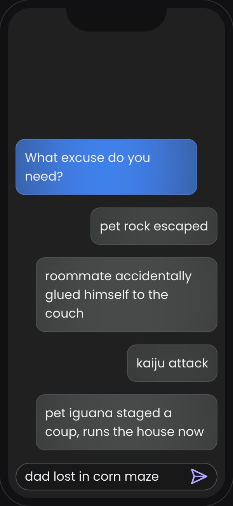

# Bailout

The Voice AI app that comes to your rescue when you need a clever escape from any situation! This lighthearted project showcases the incredible potential of advanced language models and voice synthesis by generating custom-made, entertaining excuses to help you gracefully exit from any circumstance you'd rather not be in

## Usage

Send a message to Bailout with the excuse you want, and Bailout will call you with a custom-made excuse to help you escape.

Try it on the web app, or get a Twilio number and get a call back from Bailout!

Keep your message short for the best results!

## How it works

1. The web app receives a short message from the user, through the web UI or text message, and uses Groq's API to turn it to a system message for a VAPI assistant.

2. Then the VAPI assistant calls the user back with a compelling excuse to help them escape the situation they're in.

3. Profit!

|                           |                               |                            |
| ------------------------- |-------------------------------|----------------------------|
|  |  |  |

## Acknowledgements

Thanks for https://vapi.ai/ and partners for their amazing services and for the inspiration for this project!

---

This project is my submission for the [VAPI hackathon](https://lu.ma/vapithon?tk=Fs7FgS).
