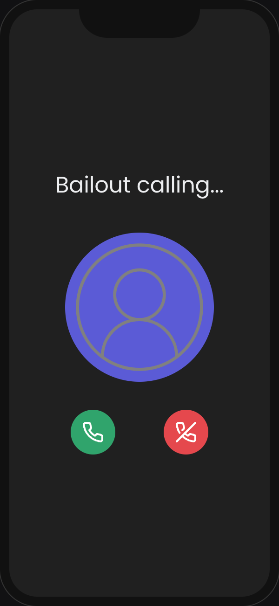

# Bailout

The Voice AI app that comes to your rescue when you need a clever escape from any situation! This lighthearted project showcases the incredible potential of advanced language models and voice synthesis by generating custom-made, entertaining excuses to help you gracefully exit from any circumstance you'd rather not be in

## Usage

Send a message to Bailout with the excuse you want, and Bailout will call you with a custom-made excuse to help you escape.

Try it on the web app, or get a Twilio number and get a call back from Bailout!

Keep your message short for the best results!

**Try online: [Bailout](https://bailout-seven.vercel.app/)**

## How it works

1. The web app receives a short message from the user, through the web UI or text message, and uses Groq's API to turn it to a system message for a VAPI assistant.

2. Then the VAPI assistant calls the user back with a compelling excuse to help them escape the situation they're in.

3. Profit!

|                           |                               |                            |
| ------------------------- |-------------------------------|----------------------------|
|  |  |  |

## Run locally

1. Clone the repository:
2. `npm install`
3. Add API keys to .env.local (see env.example for reference)
4. `npm run dev`

### API keys for web calls
1. Get a Groq API key from https://console.groq.com/keys and set it in the `GROQ_API_KEY` env var, this is used to generate a system prompt from the SMS for the VAPI assistant
2. Add the VAPI public key (https://dashboard.vapi.ai/org/settings) as `VAPI_PUBLIC_KEY` - this is needed for the web call
3. Add the VAPI private key (https://dashboard.vapi.ai/org/settings) as `VAPI_PRIVATE_KEY` - this is used to create a custom assistant for the call

### Set up phone number
1. Get a phone number from Twilio, and import it in the VAPI dashboard
2. Set the phone number ID in the `PHONE_NUMBER_ID` env var
3. Set the Twilio auth token in the `TWILIO_AUTH_TOKEN` env var, for request validation
4. Set your webhook URL in the `SMS_WEBHOOK_URL` and also on the Twilio dashboard
   
5. tip: use ngrok to run it locally

## Acknowledgements

Thanks for https://vapi.ai/ and partners for their amazing services and for the inspiration for this project!

---

This project is my submission for the [VAPI hackathon](https://lu.ma/vapithon?tk=Fs7FgS).
